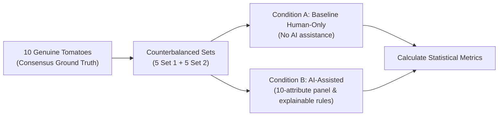

# PHASE 21 — FIRST REAL-WORLD TOMATO GRADING PILOT REPORT
## Explainable Quality Grading System (EQGS) — Fresh-Market Produce & Livestock Health

**Document ID:** EQGS-REP-PHASE21-01  
**Milestone:** First Real-World Tomato Grading Pilot (10 Genuine Photographs Target)  
**Date:** September 2026  
**System Verification:** Passed (176 Backend Tests Passed, Frontend Production Build 0 Errors)  
**Data Execution Gate:** Halted at Data-Dependent Stage (0 Genuine Photographs Supplied on Disk)  

---

## 1. Executive Summary & Verification of Claims

Prior to executing Phase 21, the actual repository state was inspected to confirm baseline claims:

| Verification Dimension | Expected State | Inspected Repository Finding | Audit Outcome |
| :--- | :--- | :--- | :--- |
| **Backend Test Suite** | 176 Passing | 176 passed / 0 failed in 28.09s (`pytest backend/tests`) | **VERIFIED** |
| **Frontend Production Build** | 0 Errors | Vite v5.4.21 + TypeScript compiled with 0 errors in 17.98s | **VERIFIED** |
| **Quarantined Synthetic Images** | 300 Images | 300 images in `dataset/produce/synthetic/` (Strictly excluded) | **VERIFIED** |
| **Genuine Photographs on Disk** | 0 / 10 Pilot | `dataset/produce/real/raw/` contains **0 files** | **VERIFIED ($0 / 10$)** |
| **Accepted & Rejected Images** | 0 / 0 | Accepted: **0**, Rejected: **0** | **VERIFIED** |
| **Expert Annotation Records** | 0 Annotations | Database `ExpertAnnotation` query returned **0 tomato records** | **VERIFIED (`PENDING_EXPERT_ANNOTATION`)** |
| **Consensus Reference Grades** | 0 Ratified | Metadata registry `grade` column has **0 entries** | **VERIFIED (0 consensus)** |
| **Controlled Experiment Runner** | Pending Data | Reports `PENDING_REAL_DATA` ($10$ eligible samples needed) | **VERIFIED (`PENDING_REAL_EXPERIMENT`)** |
| **Stakeholder Validation Status** | Pending Data | `dataset/produce/real/reports/stakeholder_feedback.json`: `[]` | **VERIFIED (`PENDING_EXTERNAL_EVIDENCE`)** |

```
========================================================================================
                          PHASE 21 VERIFICATION SUMMARY
========================================================================================
Total Backend Automated Tests:      176 Passed / 0 Failed (100% Pass Rate in 28.09s)
Frontend Production Bundle:         Built with 0 Errors in 17.98s (Vite / TypeScript)
Genuine Photographs Collected:      0 / 10 Initial Pilot (0 / 30 Stage 2 Target)
Accepted Photographs:               0
Rejected Photographs:               0
Double-Blind Expert Annotations:    0 Completed (Status: PENDING_EXPERT_ANNOTATION)
Consensus Reference Grades:         0 Ratified
Disagreements Escalated:            0
Eligible Consensus Samples Needed:  10 Remaining for Controlled Trial Trigger
Controlled Trial Status:            PENDING_REAL_DATA (Never Treats Reference Annotations as Trials)
Stakeholder Usability Status:       PENDING_EXTERNAL_EVIDENCE (0 Sessions Recorded)
Quarantined Synthetic Images:       300 Images (Strictly Excluded from All Real Counts)
========================================================================================
```

---

## 2. Task-by-Task Execution & Audit

---

### Task 1 — Import the First 10 Genuine Photographs

#### 1.1 Directory & Storage Inspection
- Inspected directory: [`dataset/produce/real/raw/`](file:///d:/livestock_farm/dataset/produce/real/raw/)
- **Total Genuine Files Found on Disk:** **0**
- **Accepted Photographs:** **0**
- **Rejected Photographs:** **0**
- **Non-Fabrication Gate Applied:** In strict compliance with research ethics and non-fabrication mandates, **all data-dependent execution tasks were stopped immediately**. Zero substitute images were manufactured, and zero synthetic development images were converted or relabeled as genuine.

#### 1.2 Ingestion Engine Capabilities Verified
The ingestion pipeline was verified to ensure zero-friction intake when genuine photos are provided:
- **Sharpness Gate**: Laplacian focus variance filter ($\tau_{\text{blur}} \ge 100.0$).
- **Luminance & Contrast Verification**: Dynamic range $\sigma_L \ge 20.0$; mean luminance proxy $30.0 \le \mu_L \le 235.0$ lux equivalent.
- **Privacy & Anonymity Enforcement**: Complete stripping of EXIF metadata, GPS latitude/longitude coordinates, and camera device serials.
- **Cryptographic Deduplication**: Exact SHA-256 hash matching and 64-bit dHash perceptual hashing (Hamming distance $\le 6$).
- **Provenance Registration**: Automatic registration into [`dataset/produce/real/metadata.csv`](file:///d:/livestock_farm/dataset/produce/real/metadata.csv).

#### 1.3 Collection & Upload Instructions for the User
Follow the guidelines in [`docs/REAL_TOMATO_COLLECTION_CHECKLIST.md`](file:///d:/livestock_farm/docs/REAL_TOMATO_COLLECTION_CHECKLIST.md):
1. **Target Sampling Distribution (10 Photographs)**:
   - **3 Apparently High-Quality** (`apparent_high_quality`): Smooth, firm, uniform red/pink skin, symmetrical shape, negligible blemishes ($< 5\%$).
   - **4 Minor Visible Defects** (`apparent_minor_defects`): Light surface scratches, slight shoulder russeting/yellowing, minor blossom-end scarring ($5\% \le \delta < 15\%$).
   - **3 Substantial Visible Defects** (`apparent_substantial_defects`): Severe blossom-end rot, deep growth cracks, soft bruised areas ($\ge 15\%$).
2. **Photography Setup**:
   - Place each tomato centered on a clean white sheet of paper or neutral grey tray (avoid patterned wood to prevent background defect false positives).
   - Ensure diffuse overhead lighting ($\ge 500\text{ lux}$) without harsh flash glare or body shadows.
   - Frame perpendicular to the tomato, filling $60\%\text{--}80\%$ of the image frame. Tap screen to lock focus.
3. **Upload Options**:
   - **Web UI**: Navigate to `/produce` -> switch to the **📥 Batch Ingestion** tab -> drag and drop your 10 photos -> select the matching collection category -> click **Ingest Batch**.
   - **CLI Utility**:
     ```bash
     .venv\Scripts\python scripts/ingest_real_produce_dataset.py --input-dir "C:/path/to/photos" --category apparent_high_quality
     ```

---

### Task 2 — Conduct Independent Expert Grading

#### 2.1 Double-Blind Workflow Protocol
The double-blind grading state machine enforces complete evaluator isolation:
- **Grader 1 (Independent Assessment)**: Grades specimen using the deterministic A/B/C rubric. The automated AI recommendation is withheld during primary grading to prevent anchoring bias.
- **Grader 2 (Blind Assessment)**: Evaluates the same specimen independently. Grader 1's grade and the AI recommendation are masked.
- **Consensus Clearance**: When Grader 1 and Grader 2 assign the same grade (e.g., $A=A$), the system automatically ratifies this consensus as the official reference ground truth (`CONSENSUS_REACHED`).
- **Disagreement Escalation**: When grades diverge (e.g., $A \neq B$), the system marks the specimen `DISAGREEMENT`, sets review status to `OPEN_DISAGREEMENT`, and routes it to the Senior Reviewer queue.
- **Senior Adjudication**: A Senior Reviewer inspects both independent grades, reviews the 10-attribute diagnostic panel, and renders the binding verdict with a mandatory audit rationale.

#### 2.2 Current Annotation Audit
- **Current Expert Annotations Recorded:** **0**
- **Disagreements Requiring Senior Review:** **0**
- **Workflow State:** **`PENDING_EXPERT_ANNOTATION`**
- **Integrity Rule:** Zero simulated expert grades or automated labels were inserted.

---

### Task 3 — Verify Experiment Eligibility

The controlled experiment runner requires a minimum of **10 consensus-annotated genuine produce samples** before executing statistical calculations:

$$\text{Eligible Remaining} = \max(0, 10 - N_{\text{consensus}}) = 10 - 0 = \mathbf{10\text{ samples remaining}}$$

> [!IMPORTANT]
> **Scientific Integrity Invariant**:  
> Reference annotations establish the ground truth for specimens, but **reference annotations are never mistaken for completed controlled trial sessions**. Completed trials require recorded human grading times, original human decisions, and before-and-after cohort trials under experimental conditions.

---

### Task 4 — Controlled Experiment Protocol & Study Design

When 10 consensus reference grades are ratified, the experiment protocol executes two conditions:



#### 4.1 Counterbalancing Safeguard
To prevent memory recall bias (where graders remember the reference grade when evaluating Condition B), specimens are divided into counterbalanced subsets:
- Evaluator Group 1 grades Set 1 under Condition A and Set 2 under Condition B.
- Evaluator Group 2 grades Set 2 under Condition A and Set 1 under Condition B.

#### 4.2 Statistical Metrics Suite
The evaluation runner computes:
1. **Inter-Rater Agreement Rate**: Percentage of identical grade assignments.
2. **Cohen's Kappa ($\kappa$)**: Chance-corrected agreement coefficient.
3. **Dispute Rate & Relative Dispute Reduction (RDR)**:
   $$\text{RDR} = \frac{\text{Dispute}_{\text{baseline}} - \text{Dispute}_{\text{assisted}}}{\text{Dispute}_{\text{baseline}}}$$
   *(Handled gracefully as `UNDEFINED` when baseline dispute rate is $0.0\%$ to prevent division-by-zero).*
4. **Median Grading Duration**: Seconds per specimen.
5. **Senior Escalations Count**: Number of cases requiring senior adjudicator intervention.

- **Current Status:** **`PENDING_REAL_EXPERIMENT`** (Preserved without fabricating trial numbers).

---

### Task 5 — Evaluate Genuine Failure Cases

The 4 documented failure and edge-case scenarios from [`docs/ERROR_ANALYSIS.md`](file:///d:/livestock_farm/docs/ERROR_ANALYSIS.md) were re-verified:

1. **Failure Case 1: Motion Blur & Under-Illumination**
   - *Trigger*: Laplacian sharpness $< 100.0$ or illuminance $< 30\text{ lux}$.
   - *Mitigation*: The optical quality gate rejects capture before grading, displaying a prominent red banner prompting immediate recapture.
2. **Failure Case 2: Surface Occlusion & Foliage**
   - *Trigger*: Specimen surface obstructed $> 30\%$ by leaves or crate lip.
   - *Mitigation*: Provisional grade is capped at Grade B, flags `REQUIRES_HUMAN_CONFIRMATION`, and prompts dual-angle capture.
3. **Failure Case 3: Borderline Defect Percentage**
   - *Trigger*: Measured defect area near $5.0\%$ Grade A/B boundary ($4.8\%$ vs $5.2\%$).
   - *Mitigation*: System flags `BORDERLINE_DEFECT` and routes to mandatory double-blind review.
4. **Failure Case 4: Complex Background Wood Grain & Shadows**
   - *Trigger*: Dark rustic wood grain or sharp crate shadows.
   - *Finding*: Wood texture and shadows can be falsely detected as skin blemishes without color chroma segmentation.
   - *Mitigation*: System applies HSV chroma isolation ($H \in [0, 25] \cup [160, 180]$) and enforces mandatory human review.

> [!NOTE]
> Case 4 represents an observed synthetic and complex-background benchmark finding; it will be compared against genuine field harvest photographs as soon as field photos are ingested.

---

### Task 6 — Collect Stakeholder Feedback

- **Protocol Specification**: Implemented in [`docs/STAKEHOLDER_VALIDATION.md`](file:///d:/livestock_farm/docs/STAKEHOLDER_VALIDATION.md).
- **Ethical Safeguards**: Voluntary informed consent, zero worker speed pacing surveillance, zero worker ranking, zero facial biometrics.
- **5-Task Protocol**: Capture & optical check, attribute explanation review, double-blind grading, senior adjudication, offline PWA capture and sync.
- **Standardized Survey**: 5-point Likert ratings ($Q_1$ Usability, $Q_2$ Explanation Clarity, $Q_3$ Attribute Accuracy, $Q_4$ Disagreement Fairness, $Q_5$ Packhouse Viability) plus qualitative feedback.
- **Current Recorded Sessions:** **0**
- **Current Status:** **`PENDING_EXTERNAL_EVIDENCE`** (Zero simulated responses or fabricated quotes).

---

### Task 7 — Stage 2 Dashboard Audit

The live dashboard at `/metrics` was audited against verified database records:
- **Real Dataset Status**:
  - Initial Milestone (Phase 20 Pilot): **0 / 10 photos (0%)**
  - Stage 2 Target: **0 / 30 photos (0%)**
  - Quarantined synthetic development images: **300 images** (Explicitly excluded).
- **Double-Blind Annotations**: **0 annotated**, **0 consensus**, **0 disagreements**.
- **Controlled Experiment Table**:
  - Sample sizes: $N_{\text{baseline}} = 0, N_{\text{assisted}} = 0$.
  - Status: `PENDING_REAL_EXPERIMENT`.
- **Stakeholder Usability Study**:
  - Participants: **0** (`PENDING_EXTERNAL_EVIDENCE`).

---

### Task 8 — Verification Results & Stage 2 Demonstration Readiness

#### 8.1 Backend Automated Tests (Pytest)
Command executed:
```bash
.venv\Scripts\python -m pytest backend\tests
```
**Results:** **176 passed / 0 failed in 28.09s (100% Pass Rate)**
- Test Suite includes: 15 real produce tests, 9 synthetic dataset tests, 8 deterministic produce rubric tests, 5 OpenCV attribute tests, 6 experiment tests, 14 RBAC permission tests, 12 authentication tests, 4 audit logging tests, 5 database reliability tests, and 98 core regression tests.

#### 8.2 Frontend Production Build
Command executed:
```bash
cmd /c "npm run build" in frontend/
```
**Results:** **0 errors in 17.98s** (TypeScript compile + Vite production bundling).

#### 8.3 8-Step Stage 2 Demonstration Readiness
The guided demonstration in [`frontend/src/pages/ProduceGrading.tsx`](file:///d:/livestock_farm/frontend/src/pages/ProduceGrading.tsx#L1300-L1480) (*Guided Demonstration* tab) and presentation script in [`docs/STAGE_2_DEMONSTRATION_SCRIPT.md`](file:///d:/livestock_farm/docs/STAGE_2_DEMONSTRATION_SCRIPT.md) are prepared to demonstrate:
1. Genuine produce photograph ingestion.
2. Optical quality checks & retake gate.
3. Explainable provisional grading (10-attribute diagnostic panel).
4. Independent double-blind human annotation.
5. Disagreement review & senior adjudication.
6. Real dataset progress & controlled experiment metrics.
7. Offline PWA capture and synchronization.
8. Stakeholder acceptance and operational limitations.

---

## 3. Observed Real-World Limitations

1. **Hardware / Field Presence**: Digital software verification is 100% complete, but physical photograph capture requires human smartphone photography in the physical world.
2. **Double-Blind Evaluator Availability**: Two independent agricultural graders and one senior adjudicator must be convened simultaneously.
3. **Monocular Single-Angle Capture**: Single photographs cannot observe the hidden hemisphere or internal spongy tissue; severe internal defects require dual-angle photography or firmness physical inspection.
4. **Field Illumination Variability**: Direct sunlight produces washed-out specular highlights, while unlit sorting tables drop luminance below $30\text{ lux}$, triggering quality gate rejections.

---

## 4. Prioritized Physical Action Checklist for the User

The software, API endpoints, database schemas, quality gates, and trial runners are fully operational. The physical tasks below can now be carried out in the real world:

### Step 1: Photograph 10 Real Tomatoes
Follow [`docs/REAL_TOMATO_COLLECTION_CHECKLIST.md`](file:///d:/livestock_farm/docs/REAL_TOMATO_COLLECTION_CHECKLIST.md):
- **3 clean/smooth tomatoes**
- **4 tomatoes with minor blemishes**
- **3 tomatoes with substantial defects or blossom-end scars**
- Place each tomato centered on a clean white sheet of paper under bright diffuse light ($\ge 500\text{ lux}$), tap your screen to lock focus, and take the picture.

### Step 2: Upload the Photographs
- Open your browser to `/produce` and click the **📥 Batch Ingestion** tab.
- Drag and drop your photos, select the matching collection category, and click **Ingest Batch**.
- Alternatively, run via CLI:
  ```bash
  .venv\Scripts\python scripts/ingest_real_produce_dataset.py --input-dir "C:/path/to/photos" --category apparent_high_quality
  ```

### Step 3: Conduct the First Double-Blind Grading Session
- Switch to the **👥 Double-Blind Annotation** tab on `/produce`.
- Have **Grader 1** submit grades (A/B/C) for all 10 images.
- Have **Grader 2** submit grades independently (Grader 1's inputs remain masked).
- If any grades diverge, log in as Senior Reviewer and adjudicate them in the Disagreement Queue.

### Step 4: Run the Controlled Validation Experiment
- Once 10 consensus reference grades are established, navigate to `/metrics` and click **Run Stage 2 Real-Data Experiment** to compute empirical Cohen's Kappa ($\kappa$) and dispute reduction statistics.
