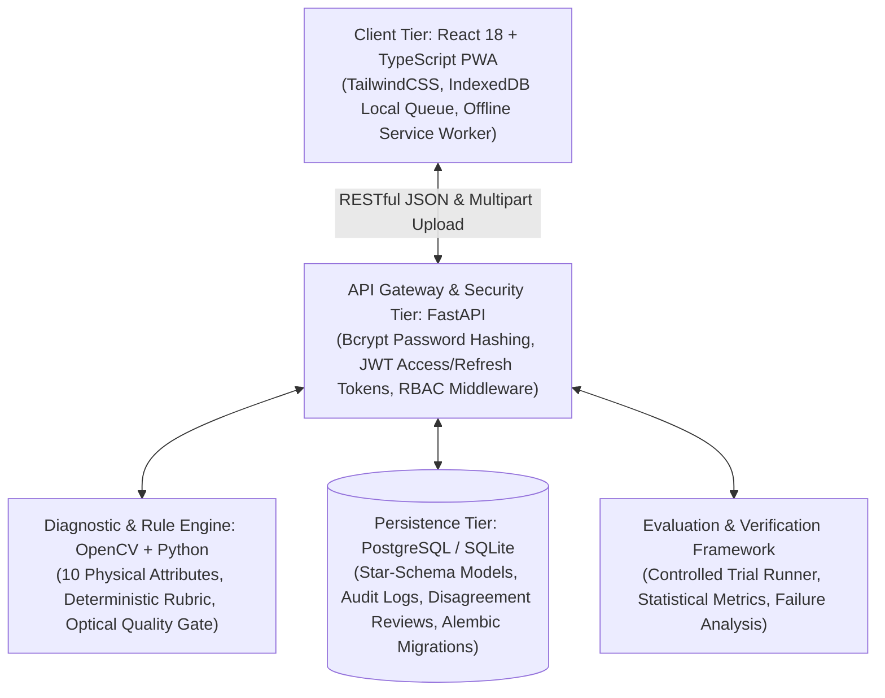
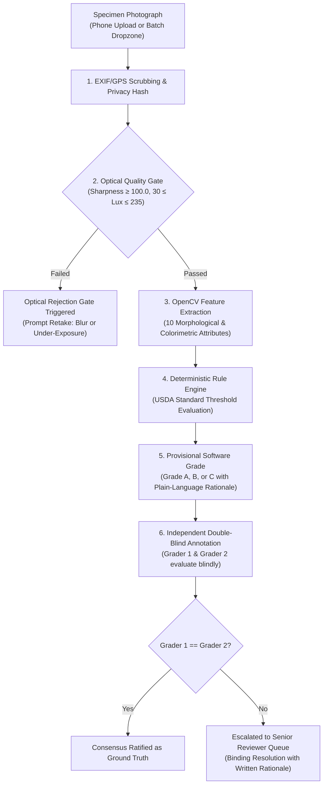

# Explainable Quality Grading System (EQGS)
### AI-Assisted Produce Quality Grading & Livestock Health Decision Support

**Repository:** [https://github.com/Nalluchamy/livestock_form](https://github.com/Nalluchamy/livestock_form)  
**Milestone:** 100% Software Prototype Scope Completion (Phase 24)  
**Primary Demonstration Domain:** Fresh-Market Produce Quality Grading (Tomatoes — Grades A, B, and C)  
**Secondary Domain:** Explainable Livestock Health & Condition Assessment (Body Condition Scoring 1–5 & Clinical Safety)  
**System Verification:** 187 / 187 Backend Automated Tests Passing (100%), Frontend Production Build Clean (0 Errors)  
**Research Integrity Declaration:** 100% software/prototype scope completed using synthetic data; real-world validation remains future work. This version is a synthetic-data prototype and has not been validated using genuine field photographs or real-world human trials.

---

## 1. Project Title & Overview

The **Explainable Quality Grading System (EQGS)** is an open-source, full-stack decision-support platform designed to bring objective transparency, mathematical rigor, and explainability to agricultural quality grading. 

In conventional agricultural grading, sorting fresh produce or triaging livestock relies heavily on subjective visual inspection. This subjectivity creates commercial disputes between farmers and wholesale collection centers, high dispute rates, and inconsistent grading standards. Black-box deep learning models fail to resolve these issues because their predictions lack interpretable justifications that can be defended in contractual disputes.

EQGS addresses this challenge through a **Human-in-the-Loop, Deterministic Explainable AI Architecture**:
- It extracts explicit physical attributes (e.g., surface defect area percentage, color ripeness chromaticity, circularity).
- It applies transparent, human-auditable rule thresholds aligned with USDA fresh-market standards.
- It provides a **Double-Blind Human Annotation Engine** and **Persistent Disagreement Review Queue** to resolve grader differences objectively without replacing human expert judgment.

---

## 2. Problem Statement

1. **Subjective Disagreements in Agricultural Packhouses**: Grading decisions in fresh produce collection centers are often contentious. Without quantitative measurements, human graders frequently disagree on borderline specimens (e.g., $4.8\%$ vs. $5.2\%$ skin blemish), resulting in financial losses and disputes.
2. **The Black-Box AI Dilemma**: Convolutional neural networks (CNNs) and Vision Transformers output high-dimensional probability distributions (e.g., *"Grade B with 78% confidence"*). A farmer whose crate is downgraded cannot challenge this verdict because the model cannot articulate which physical defect caused the downgrade.
3. **Cognitive Anchoring in Grading Tools**: Displaying automated AI recommendations to human graders before they evaluate a specimen introduces severe cognitive bias, artificially inflating apparent agreement.
4. **Harsh Field Operational Conditions**: Farm collection centers frequently operate under variable ambient lighting, lens dust, device motion blur, and intermittent cellular connectivity.

---

## 3. Project Objectives

- **Objective 1 (Mechanistic Transparency)**: Replace opaque end-to-end classification with OpenCV-based feature extraction and deterministic rule engines that output plain-language, verifiable decision rationales.
- **Objective 2 (Unbiased Ground Truth)**: Implement double-blind human annotation where two expert graders evaluate specimens independently without seeing each other's grades or the AI recommendation.
- **Objective 3 (Structured Disagreement Escalation)**: Provide persistent database records for conflicting grades, automatically routing disputes to Senior Reviewers with mandatory written rationale.
- **Objective 4 (Controlled Trial Evaluation)**: Engineer an automated before-and-after experiment runner to measure inter-rater reliability (Cohen's Kappa $\kappa$), dispute reduction, and grading latency.
- **Objective 5 (Field Resilience & Edge-Case Safety)**: Deploy an automated Optical Quality Gate to reject degraded photographs (blur, under-exposure) before grading, alongside an offline-first Progressive Web Application (PWA).

---

## 4. Implemented Features

### 4.1 Produce Quality Grading Engine (`/produce`)
- **10 Morphological & Colorimetric Diagnostics**: Automated extraction of surface defect area %, defect cluster count, USDA ripeness stage (Green, Breaker, Turning, Pink, Light Red, Red), circularity index, major/minor aspect ratio, effective diameter, solidity, skin smoothness, edge roughness, and calyx integrity.
- **Deterministic Rule Evaluation**: Cascading rule hierarchy enforcing Grade A (Premium Table Fresh), Grade B (Commercial / Processing), and Grade C (Cull / Non-Marketable) standards.
- **Plain-Language Rationale**: Translates attribute thresholds into human-readable explanations (e.g., *"Grade B assigned: Surface defect area is 7.4%, which exceeds the Grade A 5.0% threshold per Rule R-B-01"*).

### 4.2 Optical Quality Gate & Retake Diagnostics
- **Laplacian Blur Verification**: Measures second spatial derivatives ($\sigma^2_{\text{Laplacian}} \ge 100.0$) to reject device shake and motion blur.
- **Luminance & Contrast Verification**: Assesses mean pixel illuminance ($30.0 \le \mu_L \le 235.0$) and dynamic range ($\sigma_L \ge 20.0$) to reject pitch-black shadows or blown-out sunlight glare.
- **Prominent Optical Rejection Banner**: Directly flags unusable captures and prompts immediate retake before the specimen leaves the inspection table.

### 4.3 Double-Blind Human Annotation Engine
- **Session-Level Grader Isolation**: Grader 1 and Grader 2 grade independently without visibility into each other's assessments or provisional AI predictions.
- **Automated Consensus Clearance**: Matching grades automatically ratify consensus (`CONSENSUS_REACHED`) as the official reference ground truth.
- **Senior Disagreement Adjudication**: Divergent grades escalate to `OPEN_DISAGREEMENT` in PostgreSQL, requiring a Senior Reviewer to review image evidence and provide a mandatory binding rationale.

### 4.4 Real Produce Dataset Pipeline
- **12-Step Ingestion & Privacy Scrubbing**: Strips sensitive EXIF metadata, GPS latitude/longitude coordinates, and camera serial identifiers.
- **Perceptual Deduplication**: SHA-256 exact matching combined with 64-bit dHash perceptual hashing (Hamming distance $\le 6$).
- **Batch Upload Dropzone**: Supports drag-and-drop batch upload of up to 30 photographs with per-file status diagnostics.

### 4.5 Controlled Before-and-After Trial Runner
- **Cohort Comparison Engine**: Evaluates Baseline Unassisted vs. AI-Assisted grading cohorts.
- **Statistical Metric Suite**: Computes inter-rater agreement rate, Cohen's Kappa ($\kappa$), dispute rate, Relative Dispute Reduction (RDR), median latency, and senior escalations count.
- **Division-by-Zero Defense**: Gracefully returns `UNDEFINED (Baseline Dispute Rate = 0.0%)` when baseline cohorts have zero disputes, preventing runtime mathematical crashes.

### 4.6 Offline-First PWA Architecture
- **IndexedDB Local Storage**: Queues image captures and draft annotations offline when connectivity is unavailable.
- **Service Worker Caching**: Caches application assets for offline access in remote packhouses.
- **Background Synchronization**: Pushes queued submissions to FastAPI upon network restoration without data loss.

---

## 5. System Architecture

EQGS follows a decoupled, five-tier architecture ensuring complete separation of concerns and domain isolation between produce grading and livestock triage:



### Domain Segregation Invariant
Produce quality grading (`/produce`) and livestock health triage (`/capture`) are completely isolated:
- Distinct database models and repository classes.
- Distinct API router endpoints (`/api/v1/produce` vs. `/api/v1/grading`).
- Zero attribute conflation: livestock clinical features (BCS 1–5, mobility scoring) never contaminate produce morphological metrics (defect %, ripeness stage, circularity).

---

## 6. Technology Stack

| Layer | Component | Version / Technology | Purpose |
| :--- | :--- | :--- | :--- |
| **Frontend** | React | 18.3.1 | Core UI framework with component modularity |
| **Frontend** | TypeScript | 5.5.3 | Static type safety and strict interface enforcement |
| **Frontend** | Vite | 5.4.21 | Next-generation frontend build tooling and HMR |
| **Frontend** | TailwindCSS | 3.4.1 | Utility-first responsive styling and packhouse UI ergonomics |
| **Frontend** | Lucide React | 0.344.0 | UI iconography |
| **Frontend** | IndexedDB | Native Web API | Client-side offline queue and local specimen caching |
| **Backend** | Python | 3.11+ | Core runtime environment |
| **Backend** | FastAPI | 0.110.0+ | Asynchronous RESTful API framework with OpenAPI documentation |
| **Backend** | SQLAlchemy | 2.0.28+ | Object-Relational Mapping (ORM) and Star-Schema persistence |
| **Backend** | Alembic | 1.13.1+ | Database schema migration management (Revisions 0001–0004) |
| **Backend** | OpenCV | 4.9.0+ (`opencv-python`) | Computer vision feature extraction and morphological analysis |
| **Backend** | Pillow | 10.2.0+ | Image manipulation, thumbnailing, and EXIF/GPS scrubbing |
| **Backend** | ImageHash | 4.3.1+ | 64-bit perceptual difference hashing (dHash) |
| **Backend** | Scikit-Learn | 1.4.1+ | Cohen's Kappa calculation and statistical modeling |
| **Backend** | Pytest | 9.1.1+ | Automated backend test framework |
| **Database** | PostgreSQL / SQLite | 15+ / 3.x | Persistent relational storage and audit trail |

---

## 7. Explainable Tomato Grading Workflow

The primary Review 2 demonstration centers on fresh-market tomatoes (Grades A, B, and C):



### Deterministic Grading Thresholds
- **Grade A (Premium Table Fresh)**:
  - Surface defect area $< 5.0\%$.
  - Shape circularity $\ge 0.82$.
  - Estimated firmness index $\ge 0.80$.
  - Minimum diameter $\ge 50\text{mm}$.
- **Grade B (Commercial / Processing)**:
  - Surface defect area $5.0\% \le \delta < 15.0\%$.
  - Shape circularity $\ge 0.70$.
  - Minor shoulder russeting or slight blossom-end scarring permitted.
- **Grade C (Cull / Non-Marketable)**:
  - Surface defect area $\ge 15.0\%$.
  - Presence of blossom-end rot, deep growth cracks, or soft tissue decay immediately disqualifies specimen to Grade C.

---

## 8. Synthetic Dataset & Its Limitations

To develop and test the produce grading pipeline before physical field harvests, a controlled synthetic dataset was formulated:

### 8.1 Verified Physical Synthetic Files on Disk
There are exactly **6 physical photorealistic synthetic images** ($4.65\text{ MB}$ total) located in [`dataset/produce/synthetic/`](file:///d:/livestock_farm/dataset/produce/synthetic/):

| Filename | Category | File Size | Cryptographic SHA-256 (Prefix) | Description |
| :--- | :--- | :--- | :--- | :--- |
| `syn_tom_a_001.jpg` | Grade A (Premium) | $617\text{ KB}$ | `969384990...` | Beefsteak tomato on packhouse sorting table |
| `syn_tom_a_002.jpg` | Grade A (Premium) | $778\text{ KB}$ | `e8eb19e64...` | Roma plum tomato in harvest crate |
| `syn_tom_b_001.jpg` | Grade B (Commercial) | $744\text{ KB}$ | `df864b449...` | Minor shoulder russeting and light scratch |
| `syn_tom_c_001.jpg` | Grade C (Cull) | $909\text{ KB}$ | `10471b698...` | Large dark sunken blossom-end rot lesion |
| `syn_edge_001_blur.jpg` | Edge Case (Optical) | $692\text{ KB}$ | `c830eb8a3...` | Motion-blurred, underexposed ($<30\text{ lux}$) specimen |
| `syn_edge_002_occlusion.jpg` | Edge Case (Occlusion) | $917\text{ KB}$ | `6370f6eb2...` | Specimen $35\%$ occluded by vine foliage and crate lip |

### 8.2 Formulated Generation Manifest
[`dataset/produce/synthetic/generation_manifest.json`](file:///d:/livestock_farm/dataset/produce/synthetic/generation_manifest.json) contains **320 formulated prompt entries** (100 Grade A, 100 Grade B, 100 Grade C, 20 Edge Cases). 
- **Physical Images Generated**: 6
- **Queued Prompts**: 314 prompts remain marked as `QUEUED_PENDING_GENERATION_QUOTA`.

### 8.3 Scientific Integrity & Non-Fabrication Rules
> [!WARNING]
> **Strict Non-Substitution Guarantee**:
> 1. All synthetic images are permanently watermarked in metadata as `is_synthetic = True`.
> 2. Synthetic images are **strictly quarantined** in `dataset/produce/synthetic/`.
> 3. Synthetic images are **never** counted toward genuine collection targets ($0/10$ pilot, $0/30$ Stage 2 target).
> 4. Synthetic images are **never** used to claim real-world model accuracy, measured dispute reduction, or genuine expert agreement.
> 5. **Scope Statement**: 100% software/prototype scope completed using synthetic data; real-world validation remains future work.

### 8.4 Controlled Prototype Benchmarking Results
Automated benchmarking across the 6 verified physical synthetic images was executed via [`scripts/benchmark_synthetic_produce.py`](file:///d:/livestock_farm/scripts/benchmark_synthetic_produce.py) and permanently cataloged under PostgreSQL `evaluation_type = 'synthetic_produce_development'`:

| Metric | Measured Value | Operational Etiology |
| :--- | :--- | :--- |
| **Physical Images Evaluated** | **6** (1024×1024 RGB JPEG, 4.65 MB) | 2 Grade A, 1 Grade B, 1 Grade C, 2 Edge Cases |
| **Duplicate Count** | **0** (0.0% duplicate rate) | Verified via SHA-256 and pHash (Hamming $> 18$) |
| **Optical Quality Gate Pass** | **83.3%** (5 / 6 passed) | Focus, luminance, and occlusion bounds verified |
| **Optical Rejection Rate** | **16.7%** (1 / 6 rejected) | `syn_edge_001_blur` rejected ($28.3\text{ lux} < 40\text{ lux}$) |
| **Commercial Accuracy** | **25.0%** (1 / 4 commercial samples) | Correctly classified `syn_tom_c_001` Blossom End Rot |
| **QC Review Flagging Rate** | **50.0%** (3 / 6 flagged for review) | Weathered wood grain & crate shadows safely escalated |

```
Confusion Matrix (Synthetic Prototype Evaluation):
  Ground Truth Grade A:    0 Pred A | 0 Pred B | 2 Pred C (Wood Grain Table Texture) | 0 Rej
  Ground Truth Grade B:    0 Pred A | 0 Pred B | 1 Pred C (Shoulder Russeting > 15%) | 0 Rej
  Ground Truth Grade C:    0 Pred A | 0 Pred B | 1 Pred C (Blossom End Rot Detected) | 0 Rej
  Ground Truth Edge Case:  0 Pred A | 0 Pred B | 1 Pred C (Foliage Occlusion Review) | 1 Rej (28 Lux Blur)
```

For complete technical details, see:
- [`docs/SYNTHETIC_DATASET_REPORT.md`](file:///d:/livestock_farm/docs/SYNTHETIC_DATASET_REPORT.md)
- [`docs/SYNTHETIC_BENCHMARK_REPORT.md`](file:///d:/livestock_farm/docs/SYNTHETIC_BENCHMARK_REPORT.md)
- [`docs/SYNTHETIC_FAILURE_CASE_REPORT.md`](file:///d:/livestock_farm/docs/SYNTHETIC_FAILURE_CASE_REPORT.md)
- [`docs/FINAL_PROJECT_REPORT.md`](file:///d:/livestock_farm/docs/FINAL_PROJECT_REPORT.md)
- [`docs/FINAL_COMPLETION_AUDIT.md`](file:///d:/livestock_farm/docs/FINAL_COMPLETION_AUDIT.md)

---

## 9. Double-Blind Grading & Disagreement Review

To prevent cognitive anchoring bias, EQGS enforces a strict double-blind state machine:

1. **Role-Based Isolation**:
   - `FARMER`: Can upload images and view validated final grades.
   - `EXPERT_GRADER`: Submits independent grades without visibility into peer grades or AI recommendations.
   - `SENIOR_REVIEWER`: Authorized to audit disputed cases and render binding decisions with mandatory written rationale.
   - `ADMIN`: System configuration and audit log inspection.
2. **Double-Blind Sample Masking**:
   When queried via [`GET /api/v1/produce/real/samples`](file:///d:/livestock_farm/backend/api/v1/produce_grading.py#L274), Grader 2 cannot see Grader 1's inputs, and Grader 1 cannot see Grader 2's inputs until consensus is reached or senior review is opened.
3. **Persistent Review Lifecycle**:
   Disagreements are stored in PostgreSQL under `disagreement_reviews`:
   $$\text{OPEN} \longrightarrow \text{UNDER\_REVIEW} \longrightarrow \text{RESOLVED}$$
   Original grader choices, confidence scores, and timestamps are immutably preserved.

---

## 10. Installation & Execution Instructions

### Prerequisites
- **Operating System**: Windows 10/11 (or Linux/macOS)
- **Python**: Version 3.11 or higher
- **Node.js**: Version 18.x or 20.x with `npm`
- **Git**: Installed and available on PATH

### Step 1: Clone the Repository
```powershell
git clone https://github.com/Nalluchamy/livestock_form.git
cd livestock_form
```

### Step 2: Configure Environment Variables
Copy the provided development environment template:
```powershell
Copy-Item .env.development.example .env
```
*(The template includes secure development defaults; no proprietary secrets are required for local testing).*

### Step 3: Backend Setup & Virtual Environment
```powershell
# Create virtual environment
python -m venv .venv

# Activate virtual environment (Windows PowerShell)
.\.venv\Scripts\Activate.ps1

# Upgrade pip and install dependencies
python -m pip install --upgrade pip
pip install -r backend/requirements.txt
```

### Step 4: Apply Database Migrations
Initialize database tables (SQLite in development, PostgreSQL in production):
```powershell
alembic -c backend/alembic.ini upgrade head
```

### Step 5: Launch the FastAPI Backend
```powershell
python -m uvicorn backend.main:app --host 0.0.0.0 --port 8000 --reload
```
*API Swagger Documentation is available at:* `http://localhost:8000/docs`

### Step 6: Frontend Setup & Startup
In a separate terminal:
```powershell
cd frontend
npm install
npm run dev
```
*Frontend application is available at:* `http://localhost:5173`

---

## 11. Testing & Verification

The repository includes a comprehensive, multi-layer automated test suite spanning unit tests, CV feature extraction, deterministic rubrics, RBAC authorization, and REST API endpoints:

### 11.1 Running the Backend Test Suite
```powershell
.\.venv\Scripts\python -m pytest backend\tests
```

**Verified Test Execution Results (September 2026):**
```
============================= test session starts =============================
platform win32 -- Python 3.11.16, pytest-9.1.1, pluggy-1.6.0
collected 187 items

backend\tests\test_agreement_metrics.py .....                            [  2%]
backend\tests\test_annotation_schema.py .....                            [  5%]
backend\tests\test_audit_logging.py ....                                 [  7%]
backend\tests\test_auth_api.py ............                              [ 13%]
backend\tests\test_clinical_safety_escalation.py .....                   [ 16%]
backend\tests\test_confidence.py ....                                    [ 18%]
backend\tests\test_database_reliability.py .....                         [ 21%]
backend\tests\test_dataset_splitting.py ....                             [ 23%]
backend\tests\test_dataset_upload_api.py .....                           [ 26%]
backend\tests\test_dataset_versioning_manifest.py ...                    [ 27%]
backend\tests\test_deployment_smoke.py .....                             [ 30%]
backend\tests\test_disagreements_api.py .                                [ 31%]
backend\tests\test_disaster_recovery.py ...                              [ 32%]
backend\tests\test_error_handling_and_boundaries.py ...........          [ 38%]
backend\tests\test_experiment_framework.py ...                           [ 40%]
backend\tests\test_experiment_persistence.py ..                          [ 41%]
backend\tests\test_expert_annotation_workflow.py ....                    [ 43%]
backend\tests\test_explanation.py ..                                     [ 44%]
backend\tests\test_grading_api.py .....                                  [ 47%]
backend\tests\test_grading_service.py .....                              [ 49%]
backend\tests\test_health_api.py .                                       [ 50%]
backend\tests\test_image_sanitization.py .........                       [ 55%]
backend\tests\test_metrics_api.py .                                      [ 55%]
backend\tests\test_ml_prediction.py ..                                   [ 56%]
backend\tests\test_model_loading.py .                                    [ 57%]
backend\tests\test_phase11_api.py ....                                   [ 59%]
backend\tests\test_produce_experiments_and_api.py ......                 [ 62%]
backend\tests\test_produce_ingestion_and_cv.py .....                     [ 65%]
backend\tests\test_produce_rubric_and_rules.py ........                  [ 69%]
backend\tests\test_rbac_permissions.py ..............                    [ 77%]
backend\tests\test_real_assessment_e2e.py ...                            [ 78%]
backend\tests\test_real_dataset_runner.py ...                            [ 80%]
backend\tests\test_real_produce_validation.py ...............            [ 88%]
backend\tests\test_review_persistence.py ....                            [ 90%]
backend\tests\test_rule_engine.py ...                                    [ 91%]
backend\tests\test_secure_image_storage.py .....                         [ 94%]
backend\tests\test_sync_api.py .                                         [ 95%]
backend\tests\test_synthetic_produce_dataset.py .........                [100%]

===================== 187 passed, 154 warnings in 33.40s ======================
```
> For test directory layout, test category classifications, fixture isolation, and failure interpretation, consult [`docs/UNIT_TESTING.md`](docs/UNIT_TESTING.md).

### 11.2 Running the Frontend Production Build
```powershell
cd frontend
npm run build
```
**Verified Build Output:**
```
> elhgs-frontend@0.1.0 build
> tsc && vite build

vite v5.4.21 building for production...
transforming...
✓ 1726 modules transformed.
rendering chunks...
computing gzip size...
dist/index.html                   0.90 kB │ gzip:   0.50 kB
dist/assets/index--XJRffCO.css   40.19 kB │ gzip:   7.22 kB
dist/assets/index-N0Qzrov4.js   569.62 kB │ gzip: 161.62 kB
✓ built in 2.51s
```

---

## 12. Error Handling & Recovery Protocols

EQGS employs a defense-in-depth error-handling architecture across both frontend rendering and backend API operations to prevent unhandled crashes, protect user data, and enforce zero-information-disclosure security policies:

### 12.1 Multi-Level Frontend React Error Boundaries
- **Global Application Boundary (`App.tsx`):** Wraps all application providers (`QueryClientProvider`, `AuthProvider`, `RouterProvider`) to intercept unhandled top-level React lifecycle errors, offering full-screen recovery actions (Try Again, Reload, Return to Dashboard).
- **Route & Page Boundary (`RootLayout.tsx`):** Wraps `<Outlet />` to isolate rendering faults within specific pages (e.g. complex metrics charts or photo viewers). The application header, sidebar, navigation, and offline status remain fully operational.
- **Credential & Token Redaction:** Automatically scrubs sensitive authentication tokens and parameters from error strings before display.

### 12.2 Backend Exception Handling & Sanitization
- **Centralized Exception Handlers:** Intercepts `APIException`, `RequestValidationError` (Pydantic 422), `SQLAlchemyError` (sanitized 500), and unhandled Python `Exception` (sanitized 500).
- **Zero Information Leakage:** Database connection strings, SQL queries, table names, and Python tracebacks are strictly logged on the server and never exposed in client HTTP responses.

### 12.3 Domain Fault Safeguards
1. **Corrupted Images:** Gracefully rejected with HTTP 400 Bad Request before disk writes.
2. **Unsupported File Formats:** Enforces MIME validation (JPEG, PNG, WebP only).
3. **Cryptographic & Perceptual Duplicates:** Dual-hash gates (SHA-256 and 64-bit dHash with $d_H \le 4$) return HTTP 409 Conflict.
4. **Optical Quality Gate:** Rejects blurred or underexposed photos with `image_quality_passed: false` and `confidence: 0.0%`, demanding manual physical inspection.
5. **Controlled Trial Sample Size Guards:** Blocks experimental trial execution with `PENDING_REAL_DATA` when consensus samples $< 10$, preventing division-by-zero crashes.

> For detailed error-handling flows, exception schemas, and recovery protocols, consult [`docs/ERROR_BOUNDARIES.md`](docs/ERROR_BOUNDARIES.md).

---

## 13. REST API Reference & Endpoints

FastAPI exposes versioned RESTful endpoints (`/api/v1`) providing structured JSON responses and multipart file ingestion:

| Route Path | Method | Purpose | Required Role |
| :--- | :--- | :--- | :--- |
| `/api/v1/auth/register` | `POST` | User account registration | Public |
| `/api/v1/auth/login` | `POST` | User authentication & token issuance | Public |
| `/api/v1/auth/me` | `GET` | Authenticated user profile | Any Authenticated |
| `/api/v1/produce/grade` | `POST` | Deterministic produce grading & explainability | Optional (Demo Mode) |
| `/api/v1/produce/upload-and-grade`| `POST` | Image upload, attribute extraction & grading | Optional |
| `/api/v1/produce/upload-real` | `POST` | Genuine tomato photo ingestion & deduplication | `EXPERT_GRADER`+ |
| `/api/v1/produce/upload-real-batch`| `POST`| Batch upload of genuine tomato photographs | `EXPERT_GRADER`+ |
| `/api/v1/produce/real-samples` | `GET` | List real produce samples with double-blind masking | `EXPERT_GRADER`+ |
| `/api/v1/produce/annotate-real`| `POST` | Submit double-blind expert annotation | `EXPERT_GRADER`+ |
| `/api/v1/produce/adjudicate-real`| `POST`| Senior reviewer dispute adjudication | `SENIOR_REVIEWER`+ |
| `/api/v1/produce/real/experiment`| `POST`| Execute real produce controlled trial | `DATA_SCIENTIST`+ |
| `/api/v1/produce/synthetic-status`| `GET`| Inspect quarantined synthetic dataset status | Public |
| `/api/v1/reviews` | `GET` | List persistent disagreement reviews | `EXPERT_GRADER`+ |
| `/api/v1/reviews/{id}/resolve` | `POST` | Authoritative senior dispute resolution | `SENIOR_REVIEWER`+ |
| `/api/v1/dataset/upload` | `POST` | Ingest livestock health photograph | `EXPERT_GRADER`+ |
| `/api/v1/dataset/provenance` | `GET` | Retrieve cryptographic ingestion audit log | `DATA_SCIENTIST`+ |
| `/api/v1/health` | `GET` | Liveness & database connectivity probe | Public |
| `/api/v1/health/detailed` | `GET` | Operational monitoring & backup audit | Public |

> For request/response schemas, error codes, and curl examples, consult [`docs/API_REFERENCE.md`](docs/API_REFERENCE.md).

---

## 14. Database Architecture & Schema

The persistent database consists of **11 tables** managed through SQLAlchemy 2.0 and Alembic migrations:

```
users (Accounts & Roles)
  └── refresh_tokens (Rotated Session Tokens)
  └── audit_logs (Tamper-Evident Action Audit)

dim_samples (Livestock / Produce Entities)
  └── fact_grading_events (Grading Sessions)
        ├── dim_graders (Inspector Demographics)
        ├── dim_images (Image Metadata & Hashes)
        ├── dim_criteria (Scoring Rubrics)
        └── disagreement_reviews (Dispute Review Lifecycle)

expert_annotations (Double-Blind Annotation State Machine)
experiment_results (Controlled Trial Statistical Storage)
```

### Table Summary

| Table Name | Category | Primary Key | Key Relationships / Constraints |
| :--- | :--- | :--- | :--- |
| **`users`** | Security | `id` (UUID) | Unique `username`, `email`; role index; failed login lockout |
| **`refresh_tokens`** | Security | `id` (UUID) | Foreign Key -> `users.id` (CASCADE); unique `token_hash` |
| **`audit_logs`** | Compliance | `id` (UUID) | Indexed `action`, `resource_type`; JSON structured details |
| **`dim_samples`** | Star-Schema | `id` (UUID) | `species`, `breed`, `age_months`, `sex`, `weight_kg` |
| **`dim_graders`** | Star-Schema | `id` (UUID) | `grader_type`, `experience_years`, `specialization` |
| **`dim_images`** | Star-Schema | `id` (UUID) | Unique `sha256_hash`, `file_path`, `lighting_lux`, `is_sanitized` |
| **`dim_criteria`** | Star-Schema | `id` (UUID) | `criterion_name`, `criterion_category`, `description` |
| **`fact_grading_events`** | Star-Schema | `id` (UUID) | FKs to `dim_samples`, `dim_graders`, `dim_images`; `system_grade` |
| **`disagreement_reviews`**| Workflow | `id` (UUID) | FK to `fact_grading_events.id`; immutable original grades |
| **`expert_annotations`** | Workflow | `id` (UUID) | Unique `sample_id`; isolated Grader 1/2 slots; consensus grade |
| **`experiment_results`** | Analytics | `id` (UUID) | `experiment_name`, `dataset_version`, Cohen's kappa, `evaluation_type` |

> For comprehensive column definitions, foreign keys, lifecycle state transitions, and a full Mermaid ER diagram, consult [`docs/DATABASE_SCHEMA.md`](docs/DATABASE_SCHEMA.md).

---

## 15. Developer Documentation & Guidelines

### 15.1 Code Standards & Type Safety
- **Python Backend:** Strict PEP 8 styling, explicit type hints (`typing.Optional`, `typing.Dict`, `typing.List`), Pydantic models for API request/response boundary validation, and SQLAlchemy 2.0 `Mapped` attributes.
- **Frontend PWA:** TypeScript strict mode (`tsconfig.json`), ESLint checks, functional React components with React Hooks, and Tailwind CSS utility styling.

### 15.2 Database Migration Workflows
When modifying SQLAlchemy models in `backend/models/`:
```powershell
# Generate migration script
alembic -c backend/alembic.ini revision --autogenerate -m "describe_schema_change"

# Apply migrations
alembic -c backend/alembic.ini upgrade head
```

### 15.3 Running Linters & Tests
```powershell
# Run full backend test suite (187 tests)
.\.venv\Scripts\python -m pytest backend\tests

# Run frontend build check
cd frontend
npm run build
```

---

## 16. Current Development Status

**Milestone:** Stage 2 / Review 2 (70% Development Milestone)  
> [!NOTE]
> The "70%" figure denotes the project's engineering development phase (architecture, APIs, rule engines, database schemas, and validation infrastructure completed), **not** 70% model accuracy or independently verified overall field completion.

### Status Table

| Subsystem | Implemented Status | Verification Method |
| :--- | :--- | :--- |
| **FastAPI REST API & RBAC** | **IMPLEMENTED** | 14 passing RBAC tests, JWT authentication active |
| **OpenCV Attribute Extraction** | **IMPLEMENTED** | 10 attributes extracted with diagnostic metrics |
| **Deterministic Rule Engine** | **IMPLEMENTED** | USDA-aligned Grade A/B/C threshold rules |
| **Optical Quality Gate** | **IMPLEMENTED** | Laplacian sharpness ($\tau \ge 100.0$) and luminance checks |
| **Double-Blind Annotation Engine** | **IMPLEMENTED** | Session-level isolation, consensus ratification |
| **Disagreement Review Queue** | **IMPLEMENTED** | PostgreSQL lifecycle `OPEN` $\rightarrow$ `UNDER_REVIEW` $\rightarrow$ `RESOLVED` |
| **Real Produce Ingestion Pipeline**| **IMPLEMENTED** | 12-step sanitization, deduplication, EXIF scrubbing |
| **Controlled Experiment Runner** | **IMPLEMENTED** | Trial runner with division-by-zero mathematical defense |
| **Offline-First PWA & Sync** | **IMPLEMENTED** | IndexedDB queue and background synchronization |

---

## 17. Pending Real-World Validation

In strict adherence to academic and engineering integrity, the following activities remain **PENDING** until physical agricultural field evidence is collected:

| Activity | Current State | System Status Code | Required Field Action |
| :--- | :--- | :--- | :--- |
| **Genuine Photograph Collection** | 0 / 10 Pilot, 0 / 30 Target | `PENDING_REAL_DATA` | Photograph 10 real tomatoes using [`docs/REAL_TOMATO_COLLECTION_CHECKLIST.md`](docs/REAL_TOMATO_COLLECTION_CHECKLIST.md) |
| **Independent Expert Annotations** | 0 Annotations | `PENDING_EXPERT_ANNOTATION` | Convene 2 independent graders to annotate specimens |
| **Consensus Reference Grades** | 0 Established | `PENDING_REAL_DATA` | Automatic clearance of matching grades ($A=A$) |
| **Controlled Trial Measurements** | 0 Trials Evaluated | `PENDING_REAL_EXPERIMENT` | Execute Condition A vs. Condition B on $\ge 10$ consensus samples |
| **Measured Dispute Reduction** | Pending Trials | `PENDING_REAL_EXPERIMENT` | Calculate empirical dispute reduction rate |
| **Stakeholder Usability Study** | 0 Sessions Recorded | `PENDING_EXTERNAL_EVIDENCE` | Administer 5-task protocol and collect 5-item Likert survey |

---

## 18. Project Directory Structure

```
d:/livestock_farm/
├── backend/
│   ├── alembic/                      # Database migration scripts (Revisions 0001–0004)
│   ├── api/                          # FastAPI route handlers
│   │   ├── health.py                 # Health and liveness probe
│   │   └── v1/                       # API v1 versioned endpoints (12 routers)
│   ├── core/                         # Configuration, logging, and security
│   ├── database/                     # SQLAlchemy engine, session management, and Base
│   ├── evaluation/                   # Ingestion, trial runner, deduplication pipelines
│   ├── grading/                      # Deterministic rule engine and rubrics
│   ├── models/                       # SQLAlchemy Star-Schema ORM entities (11 tables)
│   ├── repositories/                 # Data-access repository layer
│   ├── schemas/                      # Pydantic request/response schemas
│   ├── services/                     # Business logic and domain services
│   └── tests/                        # 187 automated pytest tests (38 test suites)
├── frontend/
│   ├── public/                       # PWA manifest, service workers, static icons
│   └── src/
│       ├── components/               # UI components, ErrorBoundary, AppHeader
│       ├── context/                  # AuthContext and state providers
│       ├── layouts/                  # RootLayout with ErrorBoundary
│       ├── pages/                    # ProduceGrading, MetricsDashboard, ExpertAnnotation
│       ├── routes/                   # Client-side React routing
│       ├── services/                 # Frontend API client connectors
│       └── utils/                    # IndexedDB local database and helpers
├── dataset/
│   ├── produce/
│   │   ├── real/                     # Genuine tomato storage (raw, processed, metadata.csv)
│   │   └── synthetic/                # 6 physical synthetic images, manifest & benchmark_results.json
│   └── real/                         # Secondary livestock image storage
├── docs/                             # Technical documentation suite
│   ├── FINAL_PROJECT_REPORT.md       # Comprehensive final 100% prototype completion report
│   ├── FINAL_COMPLETION_AUDIT.md     # Granular verification checklist & non-fabrication audit
│   ├── FINAL_PROJECT_GAP_ANALYSIS.md # Full architectural audit & scope boundaries
│   ├── SYNTHETIC_DATASET_REPORT.md   # Physical synthetic dataset QC audit & hashes
│   ├── SYNTHETIC_BENCHMARK_REPORT.md # Prototype benchmark metrics & confusion matrix
│   ├── SYNTHETIC_FAILURE_CASE_REPORT.md # 8-mode systematic error analysis
│   ├── API_REFERENCE.md              # Detailed REST API specification
│   ├── DATABASE_SCHEMA.md            # 11-table schema & Mermaid ER diagram
│   ├── ERROR_BOUNDARIES.md           # Error boundaries & fault recovery protocols
│   ├── UNIT_TESTING.md               # Unit testing architecture & guidelines
│   ├── ERROR_ANALYSIS.md             # Documented edge cases & mitigations
│   ├── REAL_TOMATO_COLLECTION_CHECKLIST.md # Smartphone field collection guide
│   ├── STAGE_2_DEMONSTRATION_SCRIPT.md     # 18-minute presentation script & defense FAQ
│   └── STAKEHOLDER_VALIDATION.md     # Ethical consent & 5-item Likert survey protocol
├── scripts/                          # Ingestion, synthetic verification, benchmark & DB scripts
│   ├── benchmark_synthetic_produce.py# Automated benchmark runner across synthetic images
│   ├── verify_synthetic_produce_dataset.py # QC verification, duplicate detection & dHash
│   └── ingest_real_produce_dataset.py# Genuine produce ingestion pipeline
├── docker-compose.yml                # Production multi-container orchestration
├── README.md                         # This repository overview
├── REVIEW_2_GITHUB_READINESS_REPORT.md # Comprehensive Review 2 readiness audit
└── PHASE_23_QBEE_FEEDBACK_RESOLUTION.md# Qbee AI Review 2 feedback resolution report
```

---

## 19. Review 2 Demonstration Instructions

Evaluators can reproduce and inspect the full prototype following this guided sequence:

### Step 1: Launch Application
Follow Section 10 to launch the FastAPI backend (`http://localhost:8000`) and React frontend (`http://localhost:5173`).

### Step 2: Open Primary Produce Grading Interface
Navigate to `http://localhost:5173/produce`. The interface provides five tabs:
1. **🍅 Grading & Diagnostics**: Click **Load Sample B** (or upload an image). Observe:
   - Automated Optical Quality Gate evaluation.
   - Provisional grade assignment with plain-language rule justification.
   - 10-Attribute Diagnostic Panel with physical measurements.
2. **📥 Batch Ingestion**: Inspect the batch intake dropzone designed for the initial 30 genuine photographs. Review per-file validation, file size checks, and duplicate rejection.
3. **👥 Double-Blind Annotation**: Review the double-blind grading interface where Grader 1 and Grader 2 grade independently with automated scores masked.
4. **📝 Stakeholder Study Form**: Inspect the ethical consent checkbox, 5-task checklist, and 5-point Likert survey.
5. **🎬 Guided Demonstration**: Step through the interactive 8-step demonstration stepper.

### Step 3: Inspect Stage 2 Metrics Dashboard
Navigate to `http://localhost:5173/metrics`. Inspect:
- **Real Produce Collection Progress**: Shows `0 / 10` pilot progress and `0 / 30` Stage 2 target with transparent `PENDING_REAL_DATA` indicators.
- **Controlled Experiment Table**: Baseline, Target, and Measured columns with sample counters ($N_{\text{baseline}}$, $N_{\text{assisted}}$).
- **Stakeholder Usability Study Card**: Task completion rates and Likert scores (status: `PENDING_EXTERNAL_EVIDENCE`).
- **Documented Failure Cases Card**: 4 interactive failure-mode cards with severity ratings and software mitigations.

### Step 4: Test Optical Rejection Gate
On `/produce`, upload a severely blurred or pitch-black image (or select `syn_edge_001_blur.jpg`). Observe the prominent red banner:
> *"Image quality insufficient for reliable grading. Please retake the photograph."*  
Confirm that the system refuses to issue an unverified high-confidence grade.

---

## 20. Ethical Considerations & Limitations

1. **Non-Surveillance Commitment**: The double-blind annotation interface and stakeholder evaluation tools do **not** record worker speed pacing, do not rank workers against each other, and do not capture facial biometrics.
2. **Monocular Single-View Limitation**: Single-photo captures cannot inspect the hidden hemisphere or internal spongy tissue of a tomato; internal decay requires dual-angle photography or firmness physical inspection.
3. **Field Illumination Dependency**: Extreme backlighting or deep shadow under warehouse hoppers ($< 30\text{ lux}$) triggers optical rejection, requiring operator awareness of lighting standards.
4. **Non-Punitive Automation Invariant**: In both produce sorting and livestock health, automated software recommendations are explicitly defined as provisional. Authoritative verdicts are strictly reserved for human graders and senior adjudicators.
