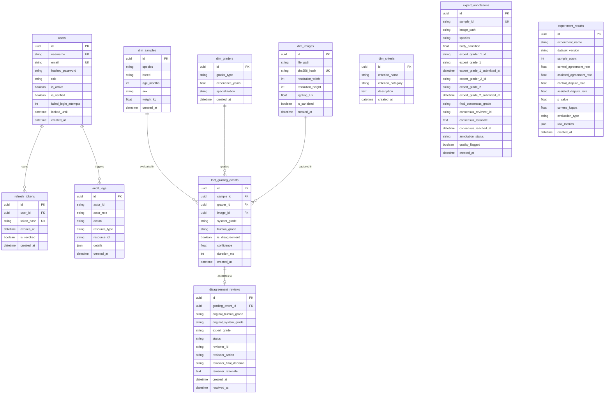
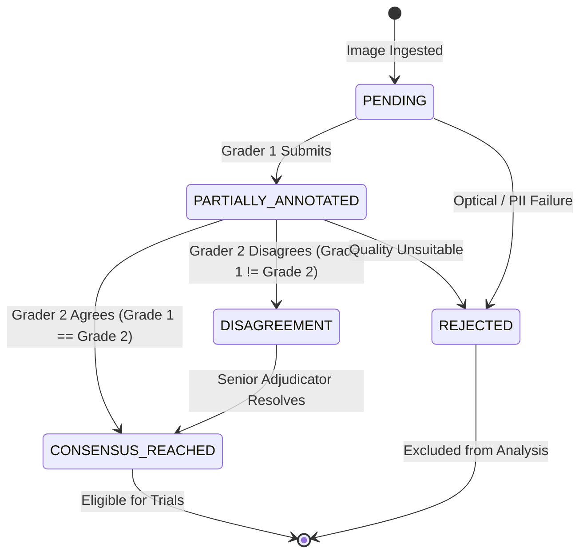
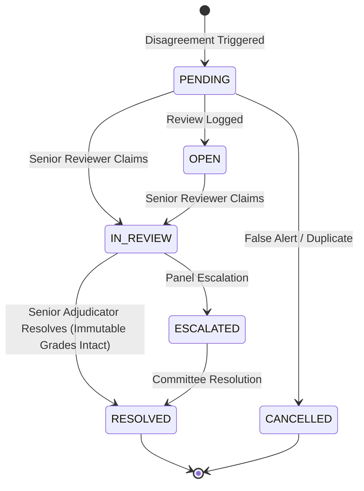

# EQGS Database Architecture & Entity Schema

**Project:** Explainable Quality Grading System (EQGS)  
**ORM:** SQLAlchemy 2.0 (Declarative Mappings)  
**Migration Engine:** Alembic  
**Target RDBMS:** PostgreSQL 15+ / SQLite 3 (In-Memory Testing)  
**Total Tables:** **11 Persistent Tables**  

---

## 1. Entity-Relationship Diagram (Mermaid)

---

## 2. Table Specifications & Column Definitions

### 2.1 User & Authentication Domain

#### `users`
Maintains user identities, RBAC roles, and account security state.
- `id` (`UUID`, Primary Key): Unique user identifier.
- `username` (`VARCHAR(100)`, Unique, Indexed, Not Null): Login handle.
- `email` (`VARCHAR(255)`, Unique, Indexed, Not Null): Verified email address.
- `hashed_password` (`VARCHAR(255)`, Not Null): Argon2 / Bcrypt cryptographic password hash.
- `role` (`VARCHAR(50)`, Indexed, Not Null, Default: `'FARMER'`): RBAC permission tier (`FARMER`, `EXPERT_GRADER`, `SENIOR_REVIEWER`, `DATA_SCIENTIST`, `ADMIN`).
- `is_active` (`BOOLEAN`, Not Null, Default: `TRUE`): Soft-deletion flag.
- `is_verified` (`BOOLEAN`, Not Null, Default: `FALSE`): Email verification status.
- `activation_token` (`VARCHAR(255)`, Nullable): One-time onboarding token.
- `reset_token` (`VARCHAR(255)`, Nullable): Password recovery token.
- `reset_token_expires_at` (`TIMESTAMPTZ`, Nullable): Recovery token expiration.
- `failed_login_attempts` (`INTEGER`, Not Null, Default: `0`): Brute-force lockout counter.
- `locked_until` (`TIMESTAMPTZ`, Nullable): Lockout cooldown timestamp.
- `created_at` / `updated_at` (`TIMESTAMPTZ`, Not Null): Audit timestamps.

#### `refresh_tokens`
Stores rotated cryptographic refresh tokens tied to active user sessions.
- `id` (`UUID`, Primary Key): Unique token record ID.
- `user_id` (`UUID`, Foreign Key -> `users.id`, OnDelete: `CASCADE`, Indexed, Not Null).
- `token_hash` (`VARCHAR(255)`, Unique, Indexed, Not Null): SHA-256 digest of the refresh token.
- `expires_at` (`TIMESTAMPTZ`, Not Null): Hard expiration timestamp (7 days default).
- `is_revoked` (`BOOLEAN`, Not Null, Default: `FALSE`): Explicit logout or rotation revocation flag.
- `created_at` (`TIMESTAMPTZ`, Not Null): Issuance timestamp.

#### `audit_logs`
Tamper-evident operational audit trail recording security, grading, and administrative actions.
- `id` (`UUID`, Primary Key): Audit record ID.
- `actor_id` (`VARCHAR(100)`, Nullable): User ID or username who initiated the action.
- `actor_role` (`VARCHAR(50)`, Nullable): RBAC role at execution time.
- `action` (`VARCHAR(100)`, Indexed, Not Null): Action verb (`AUTH_LOGIN_SUCCESS`, `PRODUCE_DISPUTE_ESCALATED`, etc.).
- `resource_type` (`VARCHAR(100)`, Indexed, Not Null): Target domain (`user`, `produce_sample`, `review`).
- `resource_id` (`VARCHAR(100)`, Nullable): ID of affected resource.
- `ip_address` (`VARCHAR(45)`, Nullable): Client IPv4/IPv6 address.
- `user_agent` (`VARCHAR(255)`, Nullable): Browser/client user-agent header.
- `details` (`JSON`, Nullable): Additional event metadata and contextual payloads.
- `created_at` (`TIMESTAMPTZ`, Not Null): Event timestamp.

---

### 2.2 Star-Schema Grading Domain

#### `dim_samples`
Dimensional entity representing an individual livestock or produce subject.
- `id` (`UUID`, Primary Key).
- `species` (`VARCHAR(50)`, Not Null): Subject species (`cattle`, `goat`, `sheep`, `tomato`).
- `breed` (`VARCHAR(100)`, Nullable): Breed or agricultural cultivar.
- `age_months` (`INTEGER`, Nullable): Subject age in months.
- `sex` (`VARCHAR(20)`, Nullable): Biological sex.
- `weight_kg` (`FLOAT`, Nullable): Measured mass in kilograms.

#### `dim_graders`
Dimensional entity capturing inspector demographics and qualifications.
- `id` (`UUID`, Primary Key).
- `grader_type` (`VARCHAR(50)`, Not Null): Category (`veterinarian`, `packhouse_inspector`, `field_worker`).
- `experience_years` (`FLOAT`, Nullable): Certified years in grading.
- `specialization` (`VARCHAR(100)`, Nullable): Domain focus.

#### `dim_images`
Dimensional entity tracking ingested image files and provenance.
- `id` (`UUID`, Primary Key).
- `file_path` (`VARCHAR(500)`, Not Null): Relative storage path.
- `sha256_hash` (`VARCHAR(64)`, Unique, Indexed, Not Null): Cryptographic file digest.
- `resolution_width` / `resolution_height` (`INTEGER`, Nullable): Spatial resolution.
- `lighting_lux` (`FLOAT`, Nullable): Measured illuminance level.
- `is_sanitized` (`BOOLEAN`, Not Null): Confirms EXIF and PII scrubbing.

#### `dim_criteria`
Dimensional entity defining evaluation rubrics and sub-criteria.
- `id` (`UUID`, Primary Key).
- `criterion_name` (`VARCHAR(100)`, Not Null): Metric name (`body_condition`, `surface_defect_pct`).
- `criterion_category` (`VARCHAR(50)`, Not Null): Category (`morphological`, `chromatic`, `pathological`).
- `description` (`TEXT`, Nullable): Rubric guidance.

#### `fact_grading_events`
Central fact table recording every completed evaluation session.
- `id` (`UUID`, Primary Key).
- `sample_id` (`UUID`, Foreign Key -> `dim_samples.id`, Nullable).
- `grader_id` (`UUID`, Foreign Key -> `dim_graders.id`, Nullable).
- `image_id` (`UUID`, Foreign Key -> `dim_images.id`, Nullable).
- `system_grade` (`VARCHAR(10)`, Not Null): AI-assigned grade.
- `human_grade` (`VARCHAR(10)`, Nullable): Inspector-assigned grade.
- `is_disagreement` (`BOOLEAN`, Not Null, Default: `FALSE`): Flags conflicting assessments.
- `confidence` (`FLOAT`, Not Null): Model or rule confidence percentage.
- `duration_ms` (`INTEGER`, Nullable): Evaluation elapsed time in milliseconds.
- `created_at` (`TIMESTAMPTZ`, Not Null).

---

### 2.3 Double-Blind Annotation & Review Domain

#### `expert_annotations`
Persistent table implementing the double-blind state machine for ground-truth consensus.
- `id` (`UUID`, Primary Key).
- `sample_id` (`VARCHAR(64)`, Unique, Indexed, Not Null): Canonical sample identifier.
- `image_path` (`VARCHAR(500)`, Not Null): Processed image path.
- `species` (`VARCHAR(32)`, Not Null, Default: `'cattle'`): Produce or livestock category.
- `body_condition` (`FLOAT`, Nullable): Clinical body condition score.
- `expert_grader_1_id` (`VARCHAR(100)`, Nullable): Identifier of Grader 1.
- `expert_grade_1` (`VARCHAR(10)`, Nullable): Independent grade submitted by Grader 1.
- `expert_grade_1_notes` (`TEXT`, Nullable): Grader 1 clinical observations.
- `expert_grade_1_submitted_at` (`TIMESTAMPTZ`, Nullable).
- `expert_grader_2_id` (`VARCHAR(100)`, Nullable): Identifier of Grader 2.
- `expert_grade_2` (`VARCHAR(10)`, Nullable): Independent grade submitted by Grader 2.
- `expert_grade_2_notes` (`TEXT`, Nullable): Grader 2 clinical observations.
- `expert_grade_2_submitted_at` (`TIMESTAMPTZ`, Nullable).
- `final_consensus_grade` (`VARCHAR(10)`, Nullable): Authoritative consensus grade.
- `consensus_reviewer_id` (`VARCHAR(100)`, Nullable): Senior reviewer who resolved dispute (if discordant).
- `consensus_rationale` (`TEXT`, Nullable): Documented resolution justification.
- `consensus_reached_at` (`TIMESTAMPTZ`, Nullable).
- `annotation_status` (`VARCHAR(50)`, Indexed, Not Null, Default: `'PENDING'`): State machine status (`PENDING`, `PARTIALLY_ANNOTATED`, `CONSENSUS_REACHED`, `DISAGREEMENT`, `REJECTED`).
- `quality_flagged` (`BOOLEAN`, Indexed, Not Null, Default: `FALSE`): Rejection flag for ungradable captures.
- `quality_issue_reason` (`TEXT`, Nullable): Justification for rejection.
- `created_at` / `updated_at` (`TIMESTAMPTZ`, Not Null).

#### `disagreement_reviews`
Maintains immutable audit records of human-system disagreements and senior adjudication lifecycles.
- `id` (`UUID`, Primary Key).
- `grading_event_id` (`UUID`, Foreign Key -> `fact_grading_events.id`, OnDelete: `SET NULL`, Indexed, Nullable).
- `original_human_grade` (`VARCHAR(50)`, Not Null): Immutable human grade at time of disagreement.
- `original_system_grade` (`VARCHAR(50)`, Not Null): Immutable AI system grade.
- `expert_grade` (`VARCHAR(50)`, Nullable): Senior reviewer's verified grade.
- `status` (`VARCHAR(50)`, Indexed, Not Null, Default: `'PENDING'`): Lifecycle status (`PENDING`, `OPEN`, `IN_REVIEW`, `UNDER_REVIEW`, `RESOLVED`, `ESCALATED`, `CANCELLED`).
- `reviewer_id` (`VARCHAR(255)`, Nullable): Senior reviewer handle.
- `reviewer_action` (`VARCHAR(100)`, Nullable): Action (`UPHELD_HUMAN`, `UPHELD_SYSTEM`, `MODIFIED_BOTH`).
- `reviewer_final_decision` (`VARCHAR(50)`, Nullable): Final binding grade.
- `reviewer_rationale` (`TEXT`, Nullable): Mandatory clinical justification.
- `created_at` / `updated_at` (`TIMESTAMPTZ`, Not Null).
- `resolved_at` (`TIMESTAMPTZ`, Nullable).

---

### 2.4 Controlled Experiments & Benchmarks

#### `experiment_results`
Stores formal statistical benchmark evaluations across synthetic development and real validation cohorts.
- `id` (`UUID`, Primary Key).
- `experiment_name` (`VARCHAR(100)`, Indexed, Not Null): Experiment identifier.
- `dataset_version` (`VARCHAR(50)`, Not Null): Ingested dataset version (`v1.0.0-test`, `v2.0-real`).
- `sample_count` (`INTEGER`, Not Null): Total samples evaluated in trial ($N$).
- `control_agreement_rate` (`FLOAT`, Not Null): Agreement rate without AI assistance.
- `assisted_agreement_rate` (`FLOAT`, Not Null): Agreement rate with EQGS assistance.
- `control_dispute_rate` (`FLOAT`, Not Null): Inter-grader dispute rate in control arm.
- `assisted_dispute_rate` (`FLOAT`, Not Null): Inter-grader dispute rate in assisted arm.
- `p_value` (`FLOAT`, Nullable): Statistical significance metric.
- `cohens_kappa` (`FLOAT`, Nullable): Inter-rater reliability coefficient.
- `evaluation_type` (`VARCHAR(50)`, Indexed, Not Null, Default: `'livestock_validation'`): Strict isolation tag (`synthetic_produce_development`, `real_produce_validation`, `livestock_validation`).
- `raw_metrics` (`JSON`, Nullable): Complete breakdown of individual trials and latency measurements.
- `created_at` (`TIMESTAMPTZ`, Not Null).

---

## 3. Double-Blind & Adjudication Lifecycles

### 3.1 Double-Blind Annotation State Machine

### 3.2 Disagreement Review Lifecycle

