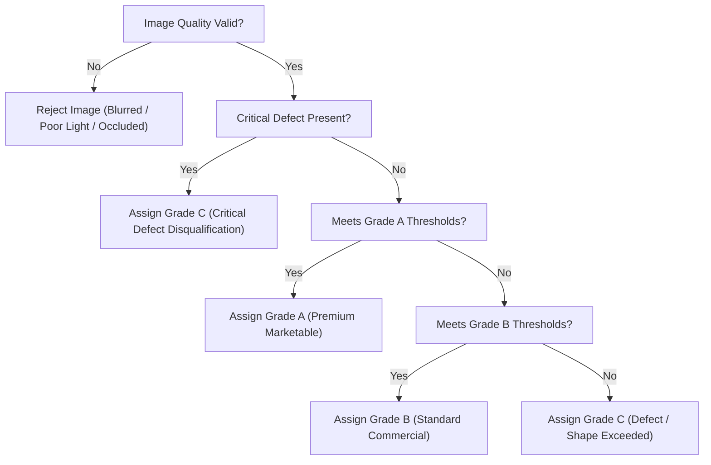

# EXPLAINABLE TOMATO QUALITY GRADING RUBRIC (STAGE 2 PROVISIONAL STANDARD)

## 1. Regulatory Context & Advisory Disclaimer

> [!IMPORTANT] Provisional Demonstration Standard Disclaimer
> The grading thresholds, color indices, and defect tolerances defined in this document represent **provisional software engineering defaults** established for the Stage 2 prototype evaluation.
>
> In accordance with agricultural standards (e.g., USDA United States Standards for Grades of Fresh Tomatoes, 7 CFR §51.1855–51.1877; UNECE Standard FFV-37), commercial deployment requires formal calibration and ratification by accredited agricultural extension services or certified commercial produce graders.

---

## 2. Grade Classifications

| Grade Tier | Commercial Classification | Description & Market Route |
| :--- | :--- | :--- |
| **Grade A** | Premium / Table Fresh | Superior visual appearance, excellent color uniformity, firm skin, near-zero blemishes. Suitable for premium grocery retail. |
| **Grade B** | Standard / Processing | Good commercial quality, minor superficial defects or slight color unevenness that do not impair internal edible flesh. Suitable for foodservice or canning/processing. |
| **Grade C** | Cull / Reject | Significant physical damage, active decay, severe cracking, or blossom-end rot. Not marketable for whole fresh consumption. |

---

## 3. Measurable Attributes & Objective Thresholds

### 3.1. Surface Defect Area Percentage ($D$)
Calculated as:
$$D = \frac{\text{Pixel Area of Visible Blemishes, Scabs, Sunscald, and Lesions}}{\text{Total Segmented Surface Area of Tomato}} \times 100\%$$

- **Grade A**: $D \le 5.0\%$
- **Grade B**: $5.0\% < D \le 15.0\%$
- **Grade C**: $D > 15.0\%$

### 3.2. Color Ripeness Stage & Uniformity
Based on the USDA 6-stage maturity scale and RGB/HSV chromaticity ratios:
1. **Green**: Surface completely green in color.
2. **Breaker**: Definite break in color from green to tannish-yellow, pink, or red on $\le 10\%$ of surface.
3. **Turning**: $10\% < \text{surface} \le 30\%$ shows pink or red.
4. **Pink**: $30\% < \text{surface} \le 60\%$ shows pinkish-red or red.
5. **Light Red**: $60\% < \text{surface} \le 90\%$ shows pinkish-red or red.
6. **Red**: $> 90\%$ of surface shows red.

- **Grade A Criteria**: Ripeness Stage 4, 5, or 6 with Color Uniformity Index $\ge 85\%$.
- **Grade B Criteria**: Ripeness Stage 2, 3, or Stage 4–6 with Color Uniformity Index $70\% - 84\%$.
- **Grade C Criteria**: Ripeness Stage 1 (immature green without breaker) or overripe/decayed mottling with Color Uniformity $< 70\%$.

### 3.3. Bruising & Mechanical Damage Severity
- **Grade A**: None / Negligible ($< 2.0\%$ surface softening, zero skin rupture).
- **Grade B**: Minor to Moderate ($2.0\% - 10.0\%$ bruised surface, intact epidermis).
- **Grade C**: Severe ($> 10.0\%$ bruised surface or ruptured skin with juice exudate).

### 3.4. Shape Symmetry & Geometric Integrity
- **Circularity Index**: $C = \frac{4\pi \times \text{Area}}{\text{Perimeter}^2}$
  - Grade A: $C \ge 0.78$ (well-rounded, symmetrical).
  - Grade B: $0.65 \le C < 0.78$ (moderately irregular).
  - Grade C: $C < 0.65$ (severely misshapen or distorted).
- **Aspect Ratio**: $AR = \frac{\text{Bounding Box Width}}{\text{Bounding Box Height}}$
  - Grade A: $0.85 \le AR \le 1.18$.
  - Grade B: $0.70 \le AR < 0.85$ or $1.18 < AR \le 1.35$.
  - Grade C: $AR < 0.70$ or $AR > 1.35$.

### 3.5. Critical Defects (Immediate Downgrade to Grade C)
Regardless of overall defect percentage, presence of any of the following triggers immediate disqualification to **Grade C**:
- Active fungal or bacterial soft rot.
- Blossom end rot extending $> 5\text{mm}$ in diameter.
- Unhealed radial or concentric growth cracks $> 15\text{mm}$ in length.
- Deep mechanical punctures exposing seed cavities.

---

## 4. Deterministic Rule Hierarchy

The Explainable Rule Engine evaluates candidate tomatoes in a strict cascading priority:

---

## 5. Borderline Escalation & Human Review Triggers

To prevent false automation on razor-thin quality boundaries, the system automatically triggers an **Escalation to Human Review** under the following deterministic conditions:

1. **Borderline A/B Defect Area**: $4.0\% \le D \le 6.0\%$ (within $1\%$ margin of the $5.0\%$ cutoff).
2. **Borderline B/C Defect Area**: $14.0\% \le D \le 16.0\%$ (within $1\%$ margin of the $15.0\%$ cutoff).
3. **Color Uniformity Uncertainty**: Color index between $82\%$ and $87\%$ with mixed turning/pink blotches.
4. **Grader Discordance**: Two independent human graders submit conflicting grades for the same sample.
5. **Partial Occlusion**: $20\% \le \text{Surface Occlusion} \le 30\%$ (provisional grade generated, but review flag attached).
