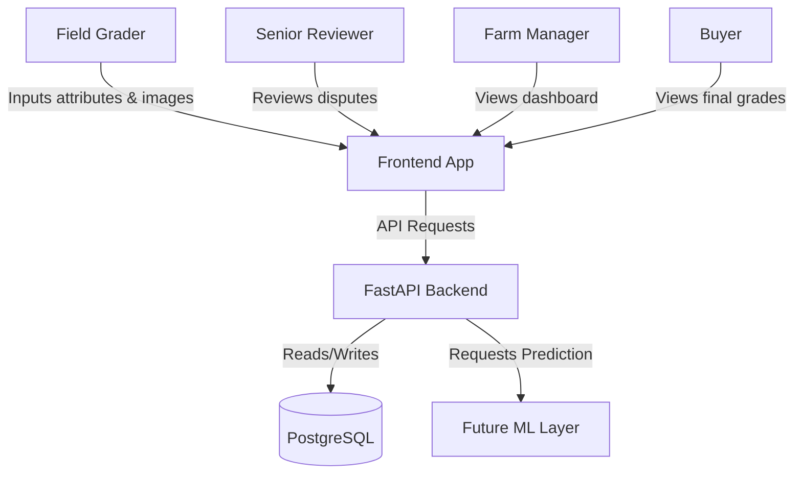
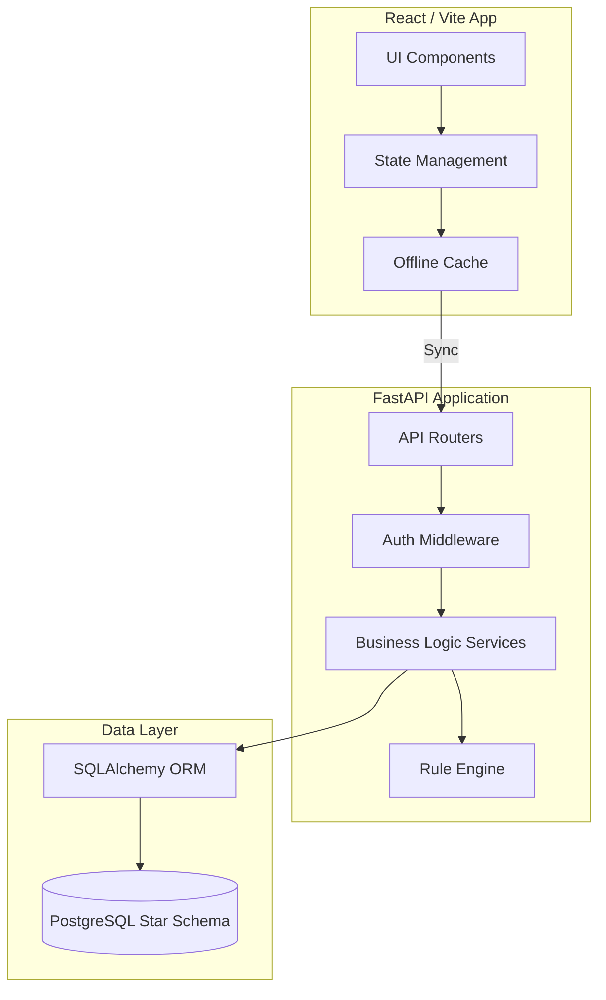
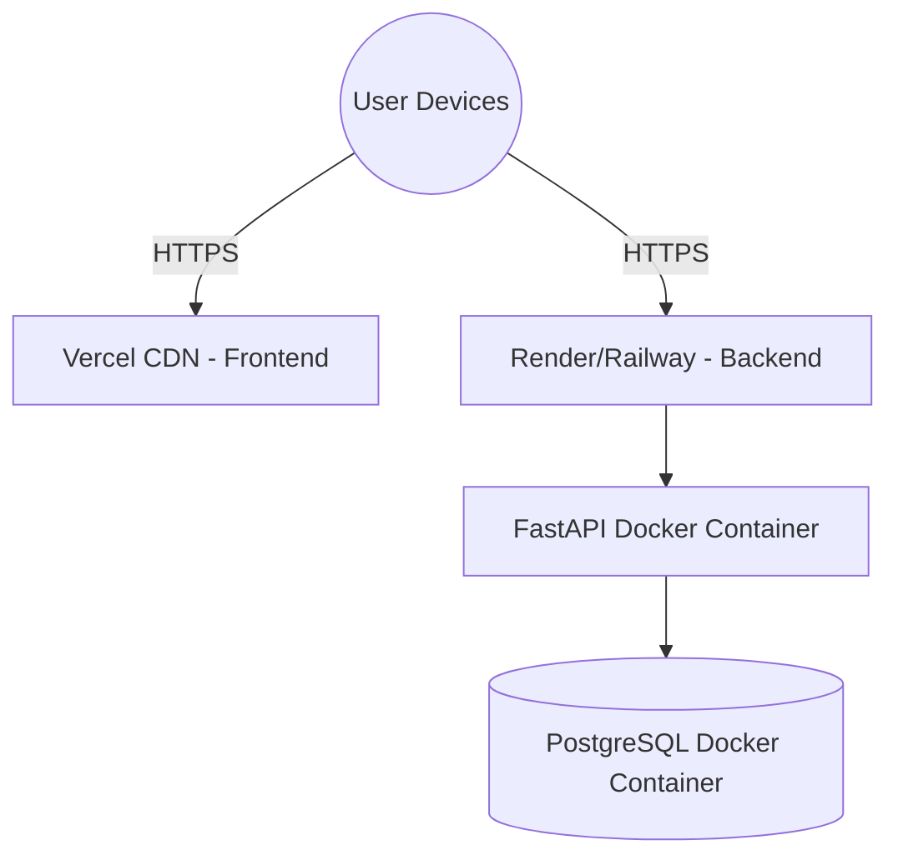
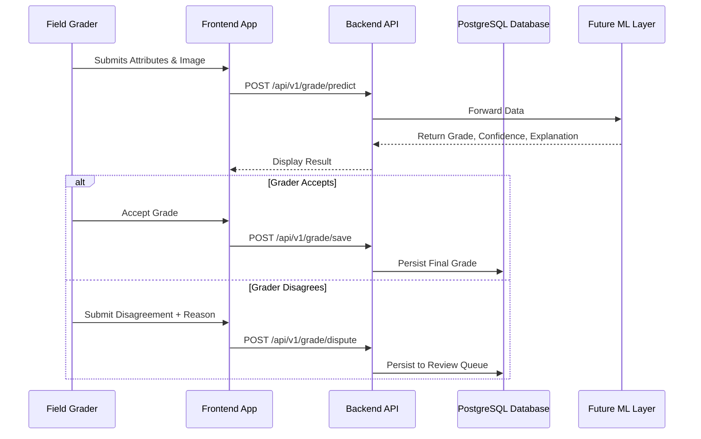

# System Architecture

This document describes the high-level architecture of the Explainable Livestock Health Grading System (ELHGS).

## System Context Diagram

## Component Diagram

## Deployment Diagram

## Data Flow Diagram

## Technology Stack
- **Frontend:** React, Vite, TypeScript, TailwindCSS
- **Backend:** Python 3.13, FastAPI, SQLAlchemy, Alembic
- **Database:** PostgreSQL (Star Schema)
- **Deployment:** Docker Compose, Vercel, Render/Railway

## Architecture Decisions
- **Local-First Frontend:** Implemented to satisfy the strong offline mode requirement.
- **FastAPI:** Chosen for high performance and native async support in Python 3.13.
- **Star Schema Database:** Optimized for dashboard aggregations and analytics.

## Future ML Layer
The future ML Layer will sit behind the backend API and act as an isolated microservice. It will utilize interpretable machine learning techniques (like SHAP or LIME) to guarantee that an explanation string is returned alongside the grade prediction.
