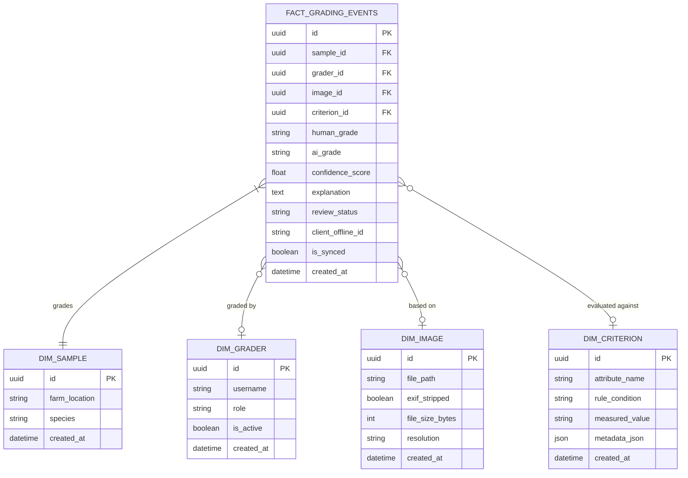

# Database Architecture

The data layer of the Explainable Livestock Health Grading System (ELHGS) is designed around a **Star Schema** to optimize for analytical queries, dashboard aggregations, and resilient offline synchronization.

## Entity-Relationship Diagram



## Star Schema Explanation
- **Fact Table (`fact_grading_events`)**: The core transactional table. Every time a grader submits a grade, accepts an AI prediction, or disputes a result, a record is created here.
- **Dimensions**: Represent the actors (`dim_grader`), the subjects (`dim_sample`), the evidence (`dim_image`), and the logical criteria (`dim_criterion`) that give context to the fact.

## Naming Conventions
- All tables are strictly lower_case_with_underscores.
- Fact tables are prefixed with `fact_`.
- Dimension tables are prefixed with `dim_`.
- Primary keys are UUIDs named `id`.

## Indexing Strategy
- **Foreign Keys**: All foreign keys in the fact table are indexed for fast joins.
- **Offline Sync**: The `client_offline_id` and `is_synced` columns are indexed to optimize the synchronization routines for mobile clients reconnecting to the server.
- **Review Status**: Indexed to allow Senior Reviewers to instantly query the dispute queue.

## Alembic Migration Workflow
Migrations are stored in `backend/alembic/versions/`.

To apply migrations locally:
```bash
alembic upgrade head
```

To autogenerate a new schema revision after altering SQLAlchemy models:
```bash
alembic revision --autogenerate -m "description of changes"
```
