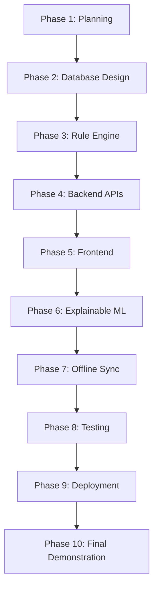

# Project Roadmap

The Explainable Livestock Health Grading System (ELHGS) is developed in iterative phases.

## Phase 1: Planning (Completed)
- Define requirements, ethics, and architecture.
- Scaffold project structure and configuration files.

## Phase 2: Database Design
- Define SQLAlchemy models.
- Set up Alembic migrations.
- Build the PostgreSQL Star Schema.

## Phase 3: Rule Engine
- Create deterministic baseline grading logic.
- Establish the disagreement review queue logic.

## Phase 4: Backend APIs
- Implement FastAPI routing.
- Integrate validation with Pydantic schemas.

## Phase 5: Frontend
- Build the React + Vite application.
- Implement UI components using TailwindCSS.

## Phase 6: Explainable ML
- Train baseline models (strictly for predicting grades).
- Integrate explainability layers (e.g., SHAP).

## Phase 7: Offline Sync
- Implement local caching on the frontend.
- Build robust CRDT or timestamp-based sync logic in the backend.

## Phase 8: Testing
- Unit tests (pytest, vitest).
- Integration testing.

## Phase 9: Deployment
- Containerize final applications.
- Deploy to Vercel and Render/Railway.

## Phase 10: Final Demonstration
- College hackathon presentation and live demo.
